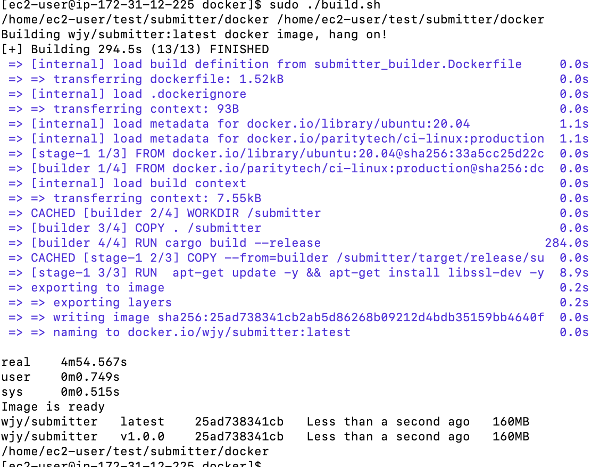

# Submitter Builder Docker Image

The Docker image in this folder is a `builder` image. It is self contained and allows users to build the binaries themselves.
There is no requirement on having Rust or any other toolchain installed but a working Docker environment.

First, install [Docker](https://docs.docker.com/get-docker/).

Then to generate the latest wjy/submitter image. Please run:
```sh
./build.sh
```



The image can be used by passing the selected binary followed by the appropriate tags for this binary.

Your best guess to get started is to pass the `--help flag`. Here are a few examples:

- `./run.sh submitter --version`
- `./run.sh submitter --help`

Then try running the following command to start a submitter.

```sh
./run.sh submitter
```
